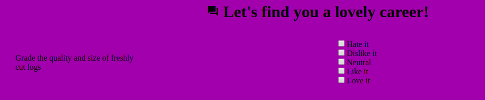

Software Engineering
====================

[this is a stack file, append here]

# Sprint 2: Engineering Document and new user stories

Taking notes on discussions and building this Document.

## Roles

- **User:** Person who will give data to get career suggestions;
- **Manager:** Organization who will provide the App to the user and manage his data;
- **Client:** Organization who is contracting the developer and delivering the App to the Manager;
- **Developer:** Organization who is receiving instructions from the Client and building the App;

## Stories

- As a User, I want to see an question and give my answer so that I can get a career suggestion.
- As the Client, I want the App to be hosted on AWS as it is my preferred
deployment method and I have the tooling and knowledge to maintain it running
and deliver to the Manager.
- As the Client, I wish the technical tooling to be similar to what I have on
my other projects so I can reuse the developer's knowledge resource in those other
projects.

## Sprint's Tasks and Goals

- [ ] Add a material card as the question container;
- [ ] Add a material radio button instead of the native select;
- [ ] Add a material toolbar with the App's name, logo, User profile link;
- [ ] Store a question's answer in a angular service;
- [ ] Display multiple questions;
- [ ] Animate the in (question presentation) and out (answer recorded);

## Git:
- ec31184 Movendo projeto angular para diretório próprio

# Sprint 1: First Prototype

General angular scaffolding, choosing technical components.

## Git:
- 46b16e4 removendo link para css de fontes do google
- b41a2e5 Adicioanando novas fontes e comoponentes de angular material
- 49daaaf Adicioando estilos e cores
- 3ec3318 Componente de questão basico, falta estilizar
- b758420 chore: initial commit from @angular/cli

# Sprint 0: Talk and planning

Using the software and process references, discuss and take note on the general
look and feel of the intended product.

## Software References
- https://www.whatcareerisrightforme.com/career-aptitude-test.php
- https://www.princetonreview.com/quiz/career-quiz
- https://www.sokanu.com/career-test/
- https://app.pathsource.com/

## Process References
- https://www.hawaiipublicschools.org/DOE%20Forms/CTE/RIASEC.pdf

## Discussion Notes

We acknowledge that the Sokanu's App is good and near what we want but there is
no need of a complex back-end (too many career choices and too many, almost
equal, questions) and the live update of the results is good to have, but not
necessary. Also the UI elements are really focused and easy to understand.

All of the references use a question set with a affinity answer with 5 options.

As far as the user experience flow is concerned, it should be as follows:
1. Sing-up with Facebook (like in other company's projects) or with email;
2. Questions show up and the App stores the answers;
3. At the end of the test (with all questions answered) the App shows a report
and career suggestions. Those suggestions should be based on a answers table.

Optional features would be:
- A better design (author's note: that is hard to understand and grasp, very
subjective to me as a programmer);
- Store the answers in a database;
- Automatically export each (user's) email through an API to an external
marketing email software.
